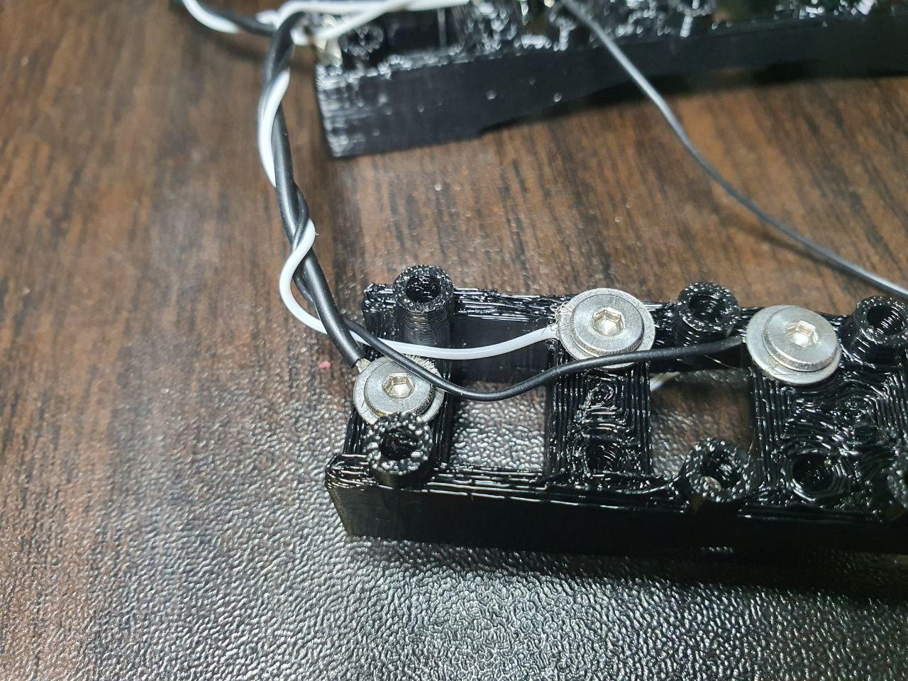
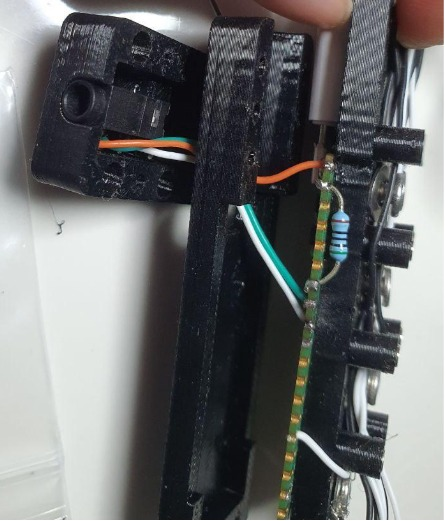

# 1. Overview
Modular keyboard with adjustable key positions.

Uses `keebio/nyquist/rev3` vial keymap. 

## 1.1. Ortholinear mode


## 1.2. Column stagger mode


## 1.3. WASD mode


## 1.4. Thumb cluster slide switches

So as to allow for toggling of those last 3 thumb cluster keys


## 1.5. Tilted column keys
2nd and 4th rows have 15 degrees tilted keys. This is for easier touch typing navigation along the y axis.


## 1.6. Tenting with magnets
Additional magnets can be used for tenting the keyboard.


# 2. Bill of materials
## 2.1. 3D models
- Column x 12

[An Internal Link](/stl/col.stl)
- Thumb cluster x 2

[An Internal Link](/stl/col.stl)
- RP2040 pico housing bottom x 2

[An Internal Link](/stl/rp2040_pico_housing_btm.stl)
- RP2040 pico housing top x 2

[An Internal Link](/stl/rp2040_pico_housing_top.stl)
- RP2040 pico housing bottom x 2

[An Internal Link](/stl/rp2040_pico_housing_top_trrs.stl)

## 2.2. Others
- 124 x 
    - M3 screw x 5mm(threads)
    
    - M3 washer x 8mm(radius) x 0.5mm(thickness)
    

    Breakdown
    - 7(per column)x12(columns) +
    - 11(per rp2040 housing) x2(rp2040 housing) +
    - 9 (thumb cluster) x2(thumb cluster)

- 124 x magnets cylindrical N52 grade 3mm x 3mm
    
- 60 x kailh choc v1 switches
    
- 60 x Geekark low profile keycaps for kailh choc v1 switches
    
- 60 x 1n4148 diodes
    
- 6 x SS12D00
    
- 2 x RP2040 pico
    
- 2 x usb-c to micro-usb adapter
    
- 2 x 430 grade steel plates(150mm x 120mm x 1.5mm thick)
- 1 x anti shatter film (to cover the steel plates)
- 1 x TRRS cable
- 1 x resistor (1kΩ-100kΩ range)
- 30 AUG wires (preferably more than 2 colors)
- 24 AUG wire (single color is enough)

# 3. Assembly
## 3.1. Fastening wires
One of the more efficient way to secure wire is to insert it through the M3 washer from 1 direction, then M3 screw from the opposite direction as shown below


## 3.2. Preparing switches
48 switches are soldered with copper wires on the left pin. These switches are for the columns


The remaining 12 switches are **soldered with 30 AUG insulated wires on the left pin** instead.

TODO add image

All switches are soldered with 1 1n4148 diode on the right pin, note the diode direction.
## 3.3. Magnets
Insert magnets with same facing poles into 3d printed parts on the same side (eg. all downward facing North pole to be on the left side of each column)

Repeat with opposite side with opposite facing pole

## 3.4. 430 Grade steel plates lamination
Laminating steel plates is not necessary, but recommended to ensure magnets slide smoothly on the plates, and also to prevent scratching and rust.

Cut the anti-shatter film by tracing loosely, the outline of the metal plate, with a pen knife.


Stick the film on the metal plate, then remove any excess film by tracing the metal plate more precisely. Cutting more precisely after sticking the film is easier as the film does not move around the plate.


## 3.5. Rows wiring
The row wires are supported by a single 24 AUG wire at row 1 that help resists pull tension.


- Starting with the first row,connect all 



## 3.6. Thumb clusters wiring
Thumb clusters must be prepared before column wiring because each column wire on the RP2040 is connected to both the the column wires from the columns and also the thumb clusters.


## 3.7. Columns wiring


Column wires use 30 AUG sizes.

Lay the wires from the furthest to the closest.
- for left side, lay column 1 first then column 6 last.
- for right side, lay column 6 first, then column 1 last.

For each column pin hole on the RP2040, solder wires of the same column from the thumb cluster and the column housing together to the RP2040.

## 3.8. Securing column switches


Secure the row wires with the switches' diodes, then secure the latter with the M3 screws and washers on the right side of the column housing as seen in the picture above. Note that each M3 screw on the right is also connected to its own row wire.

The column wiring is on the left of the column housing, which is a series of copper wires from the left pins of each switch secured together with another M3 screw and washer combo.

## 3.9. TRRS wiring




# 4. Flashing
Copy the keyboard settings to 

```
cp -R rev3/ somePath/keebio/nyquist/rev3
```
Then flash the firmware into the RP2040 controllers with the following command:
```
qmk flash -kb keebio/nyquist/rev3  -km vial  -e CONVERT_TO=promicro_rp2040
```

# 5. QMK Vial
Load keymap.vii into Vial

# 6. Fusion 360 CAD file
phasmic.f3d