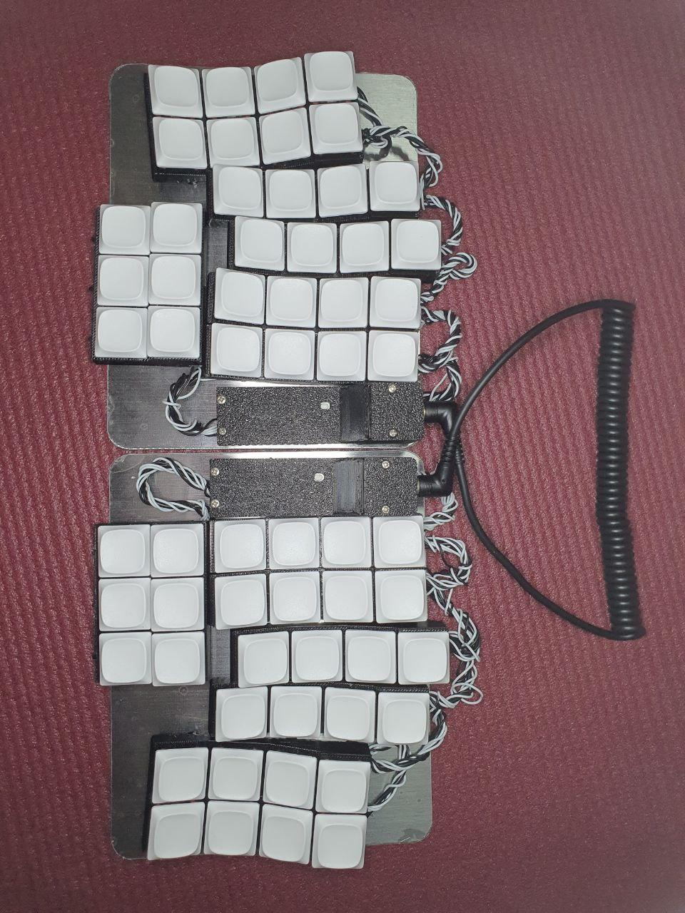
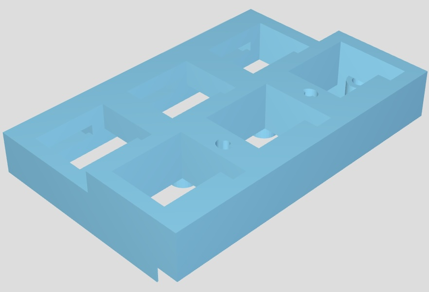
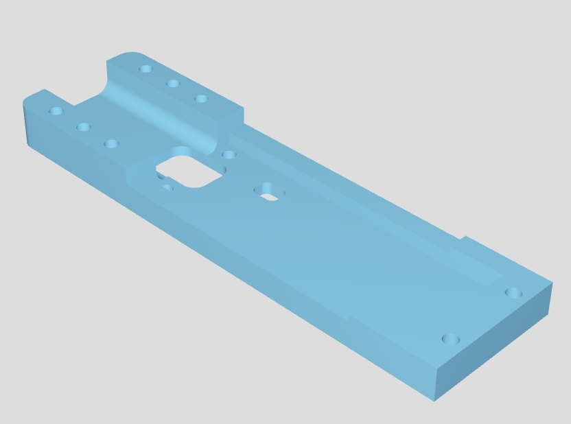

# 1. Overview
Modular keyboard with adjustable key positions.

Uses `keebio/nyquist/rev3` vial keymap. 

## 1.1. Ortholinear mode

## 1.2. Column stagger mode

## 1.3. WASD mode

## 1.4. Thumb cluster slide switches

So as to allow for toggling of those last 3 thumb cluster keys

## 1.5. Tilted column keys
2nd and 4th rows have 15 degrees tilted keys. This is for easier touch typing navigation along the y axis.

## 1.6. Tenting with magnets
Additional magnets can be used for tenting the keyboard.

# 2. Bill of materials
## 2.1. 3D models
- Column x 12

[An Internal Link](/stl/col.stl)
- Thumb cluster x 2

[An Internal Link](/stl/col.stl)
- RP2040 pico housing bottom x 2

[An Internal Link](/stl/rp2040_pico_housing_btm.stl)
- RP2040 pico housing top x 2

[An Internal Link](/stl/rp2040_pico_housing_top.stl)
- RP2040 pico housing bottom x 2

[An Internal Link](/stl/rp2040_pico_housing_top_trrs.stl)

## 2.2. Others
- 124 x 
    - M3 screw x 5mm(threads)
    
    - M3 washer x 8mm(radius) x 0.5mm(thickness)
    

    Breakdown
    - 7(per column)x12(columns) +
    - 11(per rp2040 housing) x2(rp2040 housing) +
    - 9 (thumb cluster) x2(thumb cluster)

- 124 x magnets cylindrical N52 grade 3mm x 3mm
    
- 60 x kailh choc v1 switches
    
- 60 x 1n4148 diodes
    
- 6 x SS12D00
    
- 2 x RP2040 pico
    
- 2 x usb-a to usb-c adapter
    
- 2 x 430 grade steel plates(150mm x 120mm x 1.5mm thick)
- 1 x anti shatter film (to cover the steel plates)
- 1 x TRRS cable
- 1 x resistor (1kΩ-100kΩ range)
- 30 AUG wires (preferably more than 2 colors)
- 24 AUG wire (single color is enough)

# 3. Assembly
## 3.1. Rows
## 3.2. Thumb clusters
## 3.3. Columns
## 3.4. RP2040
## 3.5. TRRS
## 3.6. Magnets
